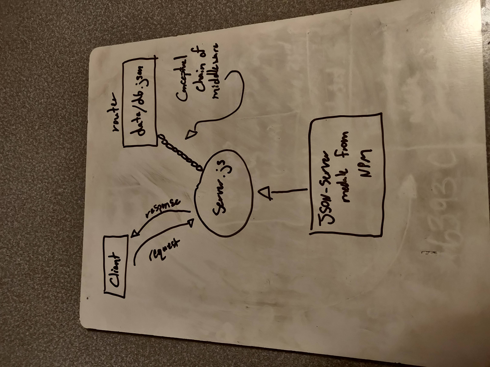
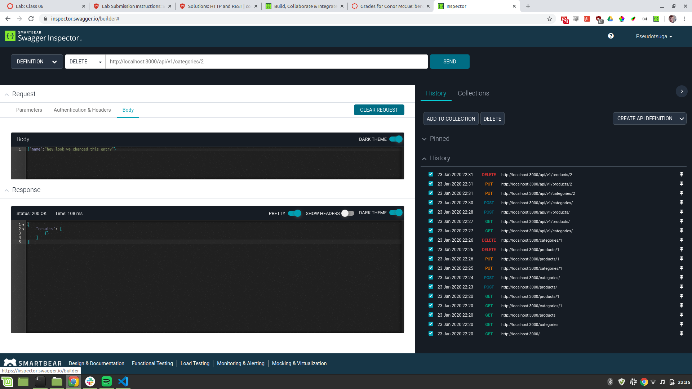
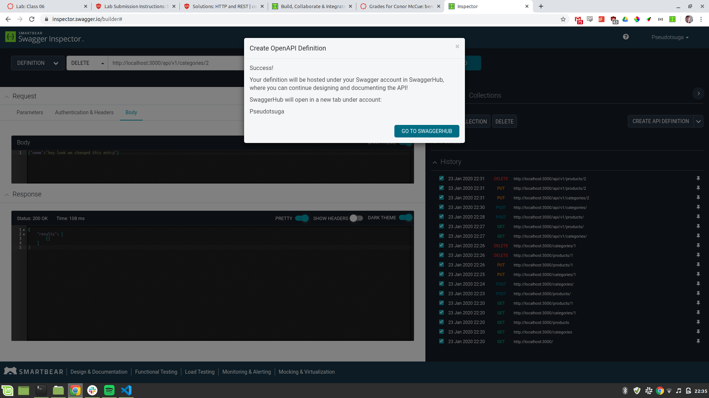
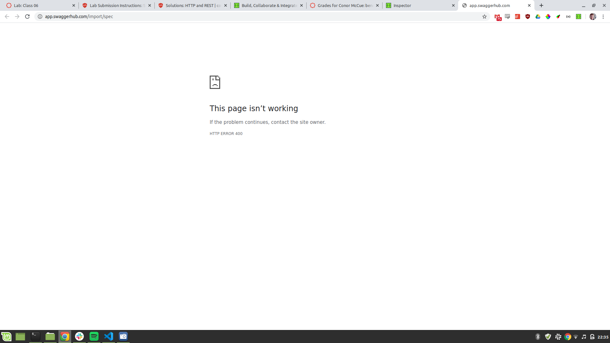

# Simple API

[Swagger Hub Link](https://app.swaggerhub.com/apis/Pseudotsuga/lab6/0.1#/)

## I attempted to reuse the swagger inspector to make a new API doc but unfortunately it kept quitting on me mid process - see proof below:

